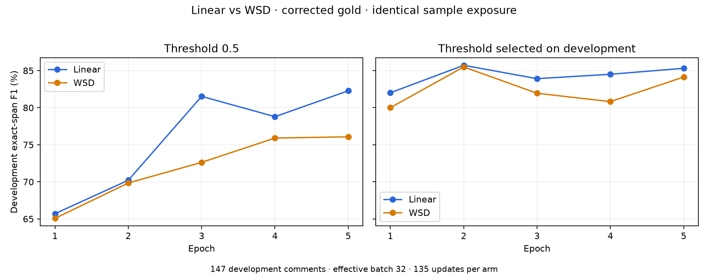
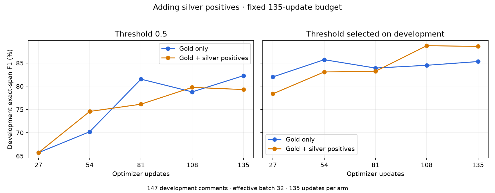

# Book extraction: trained primitive and current handoff

**Decision, 2026-09-20: park training and test extraction plus work lookup.**
The trained GLiNER is useful as a candidate generator and second-stage comment
gate. It is not a complete or final book catalog. Scheduler and data-mixture
experiments have not justified replacing the saved reference model for general
extraction. A separate existing gold-only checkpoint is useful at high gate recall.

This page owns the current state. Earlier [raw GLiNER](entity-extraction.md),
[Gemma E4B](gemma4-extraction.md), [Gemma 26B](gemma4-26b-extraction.md), and
[managed teacher](api-extraction-bakeoff.md) pages retain their historical results.
The upstream [quick filter](training.md) remains unchanged.

The downstream implementation is documented in [Current pipeline](pipeline-current.md):
Tantivy lookup with author signals, contextual reranking, popularity scoring, Luna
selection and bounded repair searches.

## Yield and operating points

The frozen 2025 corpus has 3,266,889 comments; 108,194 pass the quick filter.
The fresh random 300, fully reviewed by the user, contain **54 positive comments
(18%) and 68 title references**, deduplicated within each comment. They are not
68 distinct canonical works. Extrapolation suggests about 19,500 positive comments
among the quick-filter passes; it does not estimate positives rejected upstream.

| Existing checkpoint / threshold | Positive comments caught /54 | False-positive comments /246 | Gate FPR | Comments passed /300 | Exact titles: TP / FP / FN |
| --- | ---: | ---: | ---: | ---: | ---: |
| Reference / .50 | 51 (94.4%) | 10 | 4.1% | 61 | 56 / 20 / 12 |
| Reference / .17 | 52 (96.3%) | 10 | 4.1% | 62 | 57 / 20 / 11 |
| Gold-only five epochs / .06 | 54 (100% observed) | 24 | 9.8% | 78 | 62 / 39 / 6 |

The high-recall gate passes 26% of quick-filter candidates onward and catches all
54 positives observed here. It is worth testing when lookup is cheap. The .17
reference setting passes 20.7%, with 83.9% positive yield among forwarded comments;
the .06 gold-only setting yields 69.2%. These are post-hoc operating points on the
same 300 comments, not independently validated thresholds. One missed positive
changes measured recall by 1.85 points, so 99% here requires catching all 54.

Gate recall is not title recall. The .06 setting recovers 62/68 exact titles
(91.2%); missing candidates cannot be repaired by lookup alone. Exact-title scoring
also penalizes harmless article/boundary differences and a known source typo.
Lowering the reference model to 1e-6 only reaches 58/68 exact titles and still
misses two positive comments, while increasing false-positive comments to 24.

Checkpoint directories, relative to the repository on **melchior**:

- **Reference:** `data/probes/books-gliner-training-v1/final-refit/model`.
  Historical full-gold + older DS silver, nine epochs, effective batch 16.
- **High-recall alternative:** `data/probes/books-gliner-wsd-v1/linear/final-model`.
  Corrected gold-only, five epochs, effective batch 32. This is the final endpoint,
  not `best-model`, which was selected earlier by development F1.

The reference checkpoint at .17 has since been applied to the frozen 2025
filter-pass corpus, yielding 26,221 deduplicated references used by the resolver.
The high-recall alternative remains an evaluated alternative. This does not change
the playground checkpoint or establish a production inference service.

## Reviewed data and corrections

The annotator has **1,600/1,600 reviewed comments**: batch 1 has 1,300; batch 2
has 300 fresh random quick-filter passes. Batch 2 is evaluation-only. Teacher
outputs are preserved separately from human edits; gold is not blind teacher
acceptance. Optional authors were not separately reviewed. The sole training
label is `book title`; negatives have an empty span list, not a second label.

| Gold partition | Before alignment exclusions | Usable comments | Positive / negative |
| --- | ---: | ---: | ---: |
| Training with dev withheld | 850 | 838 | 400 / 438 |
| Development | 150 | 147 | 50 / 97 |
| Original test | 300 | 299 | 104 / 195 |
| Fresh random evaluation | 300 | 300 for title/gate scoring | 54 / 246 |

The original batch's training side was enriched. Its 300-comment evaluation was
random at annotation import, but the pilot later reshuffled all 1,300 into a
stratified 1,000/300 split. Therefore the current original test is **not** the
natural-prevalence estimate; use batch 2 for that. Historical pilot split IDs and
`books-gliner-training-v1/development-ids.json` stay frozen across later runs.

Alignment uses source offsets and the actual model word splitter. A uniquely
matching whitespace-normalized title can recover an unaligned span. Otherwise,
nonrepresentable token boundaries or unmatched titles bracket the whole comment;
they never become invented negatives. Long text uses overlapping windows without
silently truncating comments. Width 32 accommodates the longest retained titles.

A subsequent occurrence audit addressed an importer issue: literal title matching
had expanded a reviewed title into unrelated occurrences in the same comment.
For example, seven Gruffalo character references, John the Baptist, and `Escape`
inside different titles were treated as book-title spans.

- Mechanical scan: all 1,600 comments; 56 repeated-title cases, including eight
  with nested spans. Detection flags candidates; it does not decide semantics.
- Three GPT-5.6 Luna reviewers assessed 151 flagged occurrences. Parent review
  corrected missed cases and rejected an overbroad alias deletion.
- Final decisions: 133 keep, 17 remove, one uncertain left unchanged.
- **17 predicted spans removed across ten comments.** No manual spans removed;
  no comment changed positive/negative status. All other database tables remained
  identical. Same-work nested aliases were not automatically removed.
- Original annotator data remain intact. Corrected training/evaluation source:
  `data/probes/books-occurrence-audit-v1/reviewed-corrected.sqlite`.
- The correction ledger is [versioned here](assets/occurrence-corrections.json).
  The full local/remote packet and decisions also remain in that probe directory.

The corrected original test has 181 gold spans, versus 191 previously. The reference
model rescored against it has TP168 / FP45 / FN13, F1 85.3%. Do not compare that F1
with an older score as if only the model changed. Fresh-300 labels were unchanged.
Known series, short-story, lecture, and URL scope inconsistencies were left alone;
this was a bounded occurrence repair, not a second annotation pass.

## Training recipe and experiment conclusions

Model: `gliner-community/gliner_large-v2.5`, 459,494,144 parameters. GLiNER is locked
to upstream Git commit `cf9e5f7d9fb99158b592132a9ec7cbfabb43a9a0` in `uv.lock`.
The runners use upstream `Trainer`, `TrainingArguments`, and
`UniEncoderSpanDataCollator`; they do not depend on a README-only convenience API.

RTX 5090; BF16 autocast, FP32 parameters/Adam states, encoder gradient checkpointing.
Microbatch 8, encoder LR 1e-5, other LR 5e-5, weight decay .01, focal alpha .8,
gamma 0, summed loss. Recent runs use effective batch 32 and linear decay with
10% warmup. Skipped batches invalidate the run instead of silently continuing.
Peak allocated memory is about 13 GiB with checkpointing. The earlier 26.5 GiB
pilot was without checkpointing; it did not use XXL.

| Question | Observed result and decision |
| --- | --- |
| Does withholding dev hurt at this N? | Paired three-epoch gold runs: original-test F1 80.10% with 850 pre-clean training comments vs 79.81% with 1,000. No observed benefit in that single-seed pair. |
| More epochs / older DS silver? | Gold dev best 83.9% at epoch 3; gold + older silver 85.1% at epoch 9, at threshold .5. Modest gains, not a decisive silver win. |
| Effective batch 16 vs 32? | Two seeds, five epochs, identical sample order/exposure. Mean endpoint dev F1 at .5: 82.8% vs 83.9%; with threshold sweep: 85.2% vs 87.4%. Use 32 for later comparisons. |
| LR .5x / 1x / 2x? | Three epochs: threshold-selected dev F1 about 84.9% / 84.3% / 84.7%. No reason to increase LR. |
| Add 3k DS labels verbatim? | 2,990 usable comments: 413 positive, 2,577 negative. Five epochs, 605 updates, 443s. Fresh-title F1 78.2%, versus reference 77.8%; mainly a precision/recall trade. |
| WSD instead of linear? | Corrected gold; 10% warmup, about 70% stable, 20% linear decay. Same 135 updates/4,205 examples. Fresh endpoint F1 at .5: 78.4% vs 77.9%, only one fewer extra title. No clear gain. |
| Add only silver positives? | Gold 400 positive/438 negative +413 DS positives. Same 135 updates, 4,259 examples vs control 4,205 (partial batches). Fresh endpoint F1 at .5 fell 77.9% to 76.7%; at dev-chosen .99 fell 76.3% to 72.7%. No promotion. |

The positive-only arm improved endpoint dev F1 (85.3% to 88.6%) and original-test
F1 (80.2% to 85.3%) at dev-selected thresholds, but not the fresh random set.
Its dev-selected step-108 checkpoint reached fresh F1 73.5%; its step-135 endpoint
reached 72.7%. For WSD/linear, dev selected epoch two at .999, which also lost too
much recall on fresh comments (71.0% / 72.6%). Preserve both selected and endpoint
results rather than presenting only the favorable variant.





WSD and positive-only runs each took about two minutes and 13 GiB. The silver
labels were already available; these experiments incurred no new labeling calls.
The 3k teacher rollout itself cost about $0.545 in recorded usage and took 99s.
Its labels were not manually reviewed. More positive silver changes class balance
as well as coverage; its result is not a clean statement about data sufficiency.

## Error interpretation and next slice

The two manual diagnostic audits cover the fresh-300 errors and 36 additional
error comments from the original test. Those 36 had 43 extra spans and 21 misses
under the old labels. Eight misses were bad occurrence targets; 13 extras came
from two lists that already contained 27 exact matches. This is not an estimate
of error-category prevalence across the entire corpus.

For work lookup, distinguish:

- Missing titles/aliases: genuine candidate loss, such as `Mindstorms` or `SICM`.
- Article boundaries / author attached: often usable lookup inputs despite exact
  span penalties. Volume numbers and series identity are more consequential.
- Redundant multiline spans: reject/consolidate without forcing a catalog match.
- Wrong-medium collisions: a videogame mention of *Hitchhiker's Guide* can match
  a real book incorrectly. Catalog existence alone does not validate context.
- Label/scope issues: preserve ambiguous cases rather than expanding this into
  another review of all 1,600 comments.

**Next:** test both documented operating points through canonicalization to works.
Retain comment context, allow unresolved results, and measure correct work recovery,
wrong-work assignment, and unresolved candidates. No catalog integration has been
implemented yet. Missing candidates may need a later targeted extraction pass.
Larger-backbone SFT remains untested; XXL was tried only in the earlier raw-model
survey. Defer more training until the lookup test identifies the useful target.

## Artifact and command map

All `data/probes/` directories below are ignored research artifacts, available in
the local checkout and on melchior; model weights remain on melchior. They are not
PostgreSQL backups. Committed docs/charts/decision ledger preserve the conclusions;
rerunning experiments also requires the frozen data and weights.

| Directory under `data/probes/` | Contents / entry point under `packages/search-research/tools/` |
| --- | --- |
| `books-gliner-training-pilot-v1` | Original snapshot, frozen pilot IDs, memory/timing; `comment_entity_train_pilot.py` |
| `books-gliner-training-v1` | Original gold/DS curves, dev IDs, reference model; `comment_entity_train_runs.py` |
| `books-gliner-tuning-v1` | Two-seed batch comparison and LR sweep; `comment_entity_tune.py` |
| `books-annotation-random300-v2` | Reviewed fresh batch, teacher/student scoring, initial error taxonomy |
| `books-silver3000-v1` | Frozen random inputs, raw DeepSeek responses and usage |
| `books-gliner-silver3000-v1` | Full-silver run; `comment_entity_silver_run.py` |
| `books-occurrence-audit-v1` | Flagged packets, decisions, corrected snapshot; `comment_entity_occurrence_audit.py` |
| `books-gliner-wsd-v1` | Corrected paired linear/WSD and reference rescoring; `comment_entity_wsd.py` |
| `books-gliner-positive-silver-v1` | Equal-update positive-only arm; `comment_entity_positive_silver.py` |
| `books-gliner-recall-v1` | Low-floor predictions and operating points; `comment_entity_recall.py` |

From the repository root, analysis without GPU:

```sh
uv run --locked --package search-research python packages/search-research/tools/comment_entity_recall.py
uv run --locked --package search-research --with matplotlib python packages/search-research/tools/comment_entity_plot.py wsd
uv run --locked --package search-research --with matplotlib python packages/search-research/tools/comment_entity_plot.py positive-silver
```

Add `--infer` to the recall command on melchior to regenerate low-floor scores.
Training runners use the same UV command form, but intentionally refuse to
replace existing output directories: choose a new run directory before rerunning.
Historical pilot/runs/tune/silver scripts retain original inputs; the WSD and
positive-only runners explicitly load the corrected snapshot. Do not assume all
older runners automatically incorporate corrections.

Occurrence tools expose `packet SOURCE OUTPUT` and `apply PACKET DECISIONS TARGET`.
`apply` requires full decision coverage, unchanged source SHA-256, a new target,
and predicted-only removals. It preserves the source database and emits a ledger.

Runtime at handoff: `comment-embedding-dev-vllm-1` restored and healthy on melchior;
Gemma extraction servers are stopped; no training jobs are running. Full training
runs temporarily stopped the embedding container and restored it via an exit trap.
The low-floor inference probe fit alongside embedding. No new production model or
threshold was deployed by these experiments.
