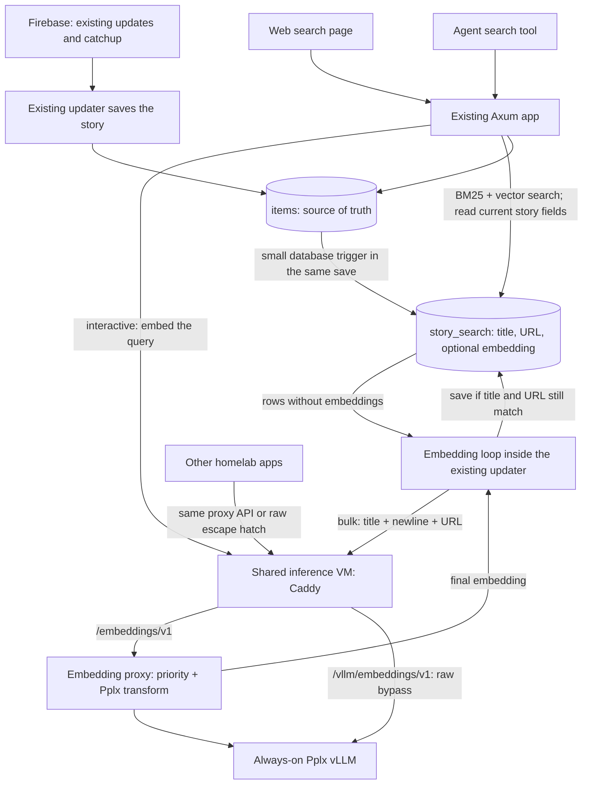

# Adding hybrid search to Search HN

Proposal for review, revised 2026-09-06. This replaces the earlier design.
The [paper](../whitepaper/search-hn.typ) settles the model and hybrid recipe.
This document explains where the work runs, what we store, and what changes when
HN updates a story. Inference is deployed. Phases 3–4 are implemented for isolated
validation; production database rollout and search cutover remain separate.

## The plan in one picture

Keep the existing updater responsible for bringing HN data into PostgreSQL.
Add an embedding loop inside that same updater process. Keep the existing Axum
app responsible for answering searches. There is one new database table.



`items` remains the authority for whether a story exists, its score and its HN
`dead`/`deleted` flags. `story_search` contains derived data for searching it.
Neither the embedding loop nor the web app fetches stories from Firebase or makes
an independent judgment about whether the source is stale.

We keep the existing Firebase updates, catchup and recent replay compromise.
This feature does **not** add historical recrawling, upstream version tracking,
or a new interpretation of Firebase's missing responses.

## Shared inference on the VM

Move the operational Pplx Compose configuration from `packages/search-research/`
to `deploy/inference/`. Put the central `Caddyfile` there too. Research documentation
links to this deployment configuration; the historical recipe remains in Git.
Use one Compose-managed model service with a stable name and restart policy.
The old launch script stops being a second way to manage the running container.

Run a small embedding proxy beside vLLM in the same inference deployment. Our
Axum app and updater always use the proxy. Other homelab apps can use the same
API and priority convention, or deliberately bypass it:

| Base URL on the inference VM | Destination | Returned embeddings |
|---|---|---|
| `/embeddings/v1` | Embedding proxy → vLLM | Final, unnormalized Pplx integer-valued coordinates |
| `/vllm/embeddings/v1` | Direct to stock vLLM | Raw pooled floats; caller owns the Pplx transform |

Both routes use central Caddy; direct means bypassing the proxy, not opening a
second public backend port. Caddy strips `/embeddings` for the proxy or
`/vllm/embeddings` for vLLM, leaving each backend's `/v1` API. Host-published backend
ports remain on loopback. The model stays in the request body, not the URL.

The proxy keeps the usual embedding request/response shape, with one optional
header identifying the workload:

```text
POST /embeddings/v1/embeddings
X-Embedding-Workload: interactive
body: {"model": "pplx-embed-v1-0.6b", "input": [...]}
```

`interactive` is the default; `bulk` marks backfills or other background embedding
work. Our app uses interactive and our updater uses bulk. Any other app can adopt
these same values; they describe the work, not the caller's identity or HN concepts.
Reject unknown values. The proxy initially supports the selected Pplx model and
rejects unsupported model names rather than applying its transform to another model.

The proxy owns the validated transform from
[`pplx_vllm_gate.py`](../tools/pplx_vllm_gate.py): tanh, multiply by 127, round,
clamp and convert to signed int8. It returns those coordinates as JSON numbers,
without L2 normalization. Our app and updater validate and consume them directly;
they must not apply the transform again. This removes model-specific math from
the Rust clients. The raw route remains useful for research, diagnostics or apps
that want their own processing. It does not silently substitute for the proxy if
the proxy fails, since the two routes return different representations.

Use vLLM's existing priority scheduling first: map interactive to priority 0 and
bulk to priority 1 with priority scheduling enabled. The pinned version exposes
this field for embedding requests; verify its behavior with our pooling setup
before relying on it. See the
[vLLM 0.28.0 request definition](https://github.com/vllm-project/vllm/blob/v0.28.0/vllm/entrypoints/pooling/base/protocol.py).
The proxy limits outstanding bulk submissions so a backfill cannot flood the
backend. This means waiting interactive work goes ahead of waiting bulk work;
it cannot interrupt a GPU operation already executing. Keep bulk batches modest.
If native priority does not work for this setup, a small in-memory dispatcher can
choose waiting interactive requests before sending the next bulk batch.

Raw-route callers bypass the proxy's bulk limits and transform. They may use
vLLM's own priority field, but can also create contention for proxy users. That is
an explicit administrator-controlled escape hatch, not a resource-isolation promise.
No policy engine is needed to anticipate every future homelab caller.

Keep the proxy stateless: no database, durable jobs, source data or retry ledger.
Bound waiting requests and return an overload/error response when it cannot accept
more. The updater already retains unfinished work in PostgreSQL and retries later.
The added service earns its place by sharing the transform and workload convention.

Implement it as a standalone `embedding_proxy` crate, initially at
`crates/embedding_proxy`. This boundary earns its keep: the proxy serves homelab
clients and can be built, deployed, restarted and upgraded independently of the
HN updater and web app.

Keep its Rust dependencies independent of `hn_core`, the updater and research
packages. It owns its HTTP contract, Pplx transform, priority handling, configuration,
tests, README and container build recipe. Copy the small golden transform fixtures
into its tests so they do not require the research archive. Backend URL and model
settings come from configuration; it knows nothing about stories or our database.
Keep the existing central Caddy and VM Compose wiring in `deploy/inference/`.

It may be a Cargo workspace member while it lives here, but clients depend only
on its HTTP API. Keep its manifest explicit and avoid parent-relative runtime
files/build scripts, so extraction means moving the crate directory, giving the
new repository its own lockfile and updating the deployment image reference.
Publish/build its image separately from HN binaries. A proxy upgrade can happen
without redeploying the updater; changes to embedding output still require an
explicit compatible contract or a coordinated index rebuild.

### Builder image versus deployed image

The proxy is a **runtime container in the same Compose stack as vLLM**. Its
Dockerfile has two stages:

1. A builder stage with Rust and compilation tools builds the release executable.
   This runs on the build machine; its toolchain and build cache are not shipped
   to the inference VM.
2. A small Debian slim runtime stage contains the stripped executable, CA
   certificates and required system libraries. Prefer Rust TLS so this proxy does
   not need an OpenSSL runtime dependency. It contains no Rust compiler, Python,
   CUDA, model weights or PostgreSQL client library.

The same release executable can alternatively run under systemd without Docker.
Containerization packages its runtime dependencies and gives it the same deployment
workflow as vLLM; it does not change where inference or the transform runs.

Proposed VM wiring (host ports are illustrative except the existing vLLM 8080):

```text
Host Caddy service: tailnet HTTPS entrypoint
  /embeddings/v1       → 127.0.0.1:8081 → embedding-proxy container
  /vllm/embeddings/v1  → 127.0.0.1:8080 → vllm container

Compose network:
  embedding-proxy → http://vllm:8000
```

The proxy reaches vLLM by its Compose service name, not container-local loopback.
Only vLLM gets GPU access and the persistent weight/cache mounts. The proxy has
ordinary configuration, logs to stdout and needs no persistent volume. Caddy stays
as a host service; it is managed by the central inference deployment configuration.
Restarting or replacing the proxy container does not require restarting vLLM.

Use `magi07-registry.tail7a3eb.ts.net` for the proxy's final runtime image. `/home`
is Zot's web UI, not part of Docker image names. Proposed image repository:
`magi07-registry.tail7a3eb.ts.net/homelab/embedding-proxy`. Build for the inference
VM's x86_64 architecture, push a versioned image, and deploy its digest through
Compose. Keep prior digests for rollback.

On 2026-09-06 the proxy image was pushed from the build machine and pulled by the
inference VM without supplying a new registry key. The VM initially could not
resolve/reach Zot; adding the administrator's `registry-consumer` tag fixed that.
If registry authentication changes, use Docker login; never put credentials in
this repository or the helper script.

Add a small publish helper beside the proxy's Dockerfile so it can move with the
crate. It accepts registry/repository and version tag, builds the linux/amd64
runtime image with Buildx, pushes it and records the returned digest for Compose.
It does not edit the running deployment or implicitly deploy `latest`. Build caches
stay on the build machine unless separately published for build reuse.

**Measured runtime artifacts (2026-09-06):**

| What | Disk size | Where it lives |
|---|---:|---|
| Stripped proxy executable, bare-metal option | 5.50 MiB, plus runtime libraries | VM or runtime image |
| Final Debian slim proxy image | 91.66 MiB unpacked; 35.86 MiB compressed layers | Zot and VM Docker storage |
| Rust builder and Cargo cache | Not shipped; size depends on retained build cache | Build machine only |

The proxy measured 6.01 MiB RSS before load, 10.54 MiB after load and an 11.79 MiB
process high-water mark during 16 concurrent requests. The image is not duplicated
in RAM, and the proxy adds no GPU memory use. See the
[deployment evidence](../../../../deploy/inference/evidence/README.md) for exact
bytes, test scope and the observed distinction between model repeatability and
transform correctness.

Keep the already tested BF16 configuration: RTX 3060 12 GiB, pinned vLLM image and
model revision, mean pooling, 2048-token serving limit. The experiment measured
about 1,735 MiB peak GPU memory for its workload. This is information for the
homelab administrator, **not a resource reservation**. The administrator decides
what else runs on the card. No global scheduler, new quota service or hypothetical
future-client load test is a prerequisite for this feature.

The embedding loop initially sends one batch at a time and exposes a batch-size
setting. That makes this project's backfill easy to slow down if it interferes
with actual use. If inference is unavailable, ingestion continues, embedding work
waits, and search can use BM25. The same behavior applies if the proxy is unavailable.

## Storage: measured int8 versus float16 versus float32

The [comparison has now run](int8-storage-eval.md) on all 64,638 frozen stories and
196 questions. Exact native-int8 cosine reproduced the paper's scores. Float32,
float16 and native bytes with a float16 HNSW index had identical target counts and
nDCG at the evaluated cutoffs. There was **no measured additional quality penalty**
from either smaller layout; approximate candidate lists were not identical.

| Layout | Hybrid hits@20 /196 | ANN median | Actual table + indexes |
|---|---:|---:|---:|
| Float32 table + float32 HNSW | 156 | 21.56 ms | 849.91 MiB |
| Float16 table + float16 HNSW | 156 | 11.85 ms | 344.27 MiB |
| Native int8 bytes + float16 HNSW | 156 | 20.36 ms | 295.55 MiB |

Exact hybrid search found 158 targets. These are matched local ARM scratch-PG
measurements, not production timing predictions. Sizes include ID/embedding tables,
TOAST, primary keys and HNSW; title/BM25 storage is separate.

**Revised recommendation for review: store the unnormalized native integer values
in a plain `halfvec(1024)` column.** Every int8 value fits exactly in float16; this
does not further quantize model output. It uses two bytes per coordinate rather
than one, but needs no byte-unpacking helper. Both query and document vectors use
the native integer coordinates and cosine distance. The writer validates shape,
range, integer values and nonzero norm before storing them.

Native `bytea` storage works, but did cut against pgvector's query interface:

- It needed a custom SQL converter. Its first index build failed until the cast
  inside the function was qualified as `public.halfvec`.
- Omitting the explicit dimension cast from the indexed expression in a query
  caused a full-scan plan instead of using HNSW.
- One exact bytea cosine scan took 5.18s, versus 90.5ms median for plain halfvec.
  Converting every row in SQL is a costly fallback path.

The bytes layout saves another 48.73 MiB (14.2%) versus halfvec on the slice, while
its ANN query was 72% slower. Scaling measured sizes to 509,118 stories suggests
about 2.27 GiB for bytes versus 2.65 GiB for halfvec: roughly 0.38 GiB saved. This
is a linear estimate, not a measured full-history size. Bytea remains a valid
space-first alternative if that saving outweighs the extra SQL/performance cost.
There is no measured quality reason to use float32 table storage here.

The underlying distinction remains: PostgreSQL can save native int8 bytes, but
pgvector 0.8.2 has no int8 cosine/HNSW operator class. Its float16 path supports
cosine; its bit path uses Hamming/Jaccard instead. See the
[operator declarations](https://github.com/pgvector/pgvector/blob/v0.8.2/sql/vector.sql)
and the [Pplx model card](https://huggingface.co/perplexity-ai/pplx-embed-v1-0.6b).
The report retains exact metrics, plans, the failed attempt and reproduction code.

## One derived table, with a reason for each field

Proposed `story_search` table in the existing application database:

| Field | Why it exists |
|---|---|
| `story_id` primary key, foreign key to `items`, delete cascades | One search record per story; physically deleting the source removes it |
| `title`, `url` | Exact text used for embedding; title also supplies the story-only BM25 index |
| `embedding halfvec(1024)`, nullable | Native integer values stored exactly in float16; NULL means this story still needs embedding |
| `retry_after`, default now | Prevent a failed inference request being retried in a tight loop |

This table is both the search data and the pending-work list. There is no job table,
lease table, source-revision table, generation registry or backfill-progress table.
Failed calls leave embedding=NULL and move retry_after forward. Log their errors
through the existing logging system. Count pending rows for progress.

The small title/URL copy has two purposes: keep the BM25 corpus limited to admitted
stories, and know exactly what an embedding request was made from. Scores, dates,
authors, comment counts and HN flags stay in `items`; search joins to it for those
fields. No separately maintained metadata copy or staleness policy is needed.

Initial scope proposed for review: live stories at score >=25, nonblank title,
valid timestamp, all history, including self-posts. Documents remain title + newline
+ URL, with an empty URL for self-posts. Body/comment embedding is outside this
change. The all-history choice extends beyond the paper's two-year evaluation
slice, so the interface should state its scope plainly.

Put admission and title/URL synchronization in **one database function**, called
by a small trigger when relevant source fields change. It inserts/updates/removes
the derived row as part of saving `items`. It only clears the embedding when the
title or URL actually changes. This covers catchup, realtime and the existing
admin create/delete paths with the same rule. It does local SQL, never HTTP.

A changed title/URL also resets retry_after so new content can be processed now.
If an HN deletion payload omits the story type, the trigger uses the previous row
to recognize and remove its search entry.

Why a trigger here? It means a saved source row and its derived search row cannot
get out of step because one caller forgot the second write. Its cost is an extra
small-table/index write on relevant story changes. That is the one deliberate
synchronous cost; measure it alongside normal ingest before enabling it broadly.
Comment writes and comment-lineage repair require no search work.

## What happens when a story changes

| What the updater saves in `items` | What happens to search |
|---|---|
| New story below 25 points | Nothing to embed yet |
| Story reaches 25 | Trigger adds title/URL with embedding=NULL; BM25 can find it immediately |
| Embedding finishes | Updater's embedding loop fills in the embedding; semantic search can now find it too |
| Title or URL changes | Trigger updates the text and clears the old embedding; loop embeds the new text |
| Score changes but remains eligible | Search reads the new score from `items`; existing embedding remains valid |
| Comment count changes | Search reads the new count; no embedding work |
| HN marks it dead/deleted, or score falls below 25 | Trigger removes its search row |
| Physical source deletion | Foreign key removes its search row |

Removing a search row also removes its pending work. If a demoted story becomes
eligible again, it gets embedded again. Avoiding that occasional repeated request
does not justify a second retention mechanism.

The only race the embedding loop needs to handle is easy to describe:

```mermaid
sequenceDiagram
  participant U as Existing updater
  participant DB as PostgreSQL
  participant E as Embedding loop in updater
  participant V as Embedding proxy and vLLM
  E->>DB: Read story 42, title A, no embedding
  E->>V: Embed title A + URL
  U->>DB: HN changed the title to B
  Note over DB: Trigger saves B and leaves embedding empty
  V-->>E: Embedding for A
  E->>DB: Save only if current title and URL still equal my input
  DB-->>E: They changed; discard this result
  E->>V: Next pass embeds B
```

The save checks current source eligibility and exact title/URL while briefly locking
the source row. It writes only to the still-matching search row; it never inserts
an absent story as a side effect of receiving an old HTTP response. Release the
lock before any inference request. This check does not establish a second source
of truth: it asks the existing source whether the work is still applicable.

One embedding loop handles batches sequentially. If the updater crashes before
saving, the NULL embedding remains and the next run retries it. No distributed
worker claims or leases are needed. Enable this loop in the long-running updater,
not in every catchup invocation. The existing updater service owns its lifecycle
and uses its existing database credentials. No separate vector-writer principal.

## Backfill uses that same loop

Add a backfill command to the existing `catchup_worker` binary. Its only job is to
walk existing story IDs in bounded batches and call the same synchronization
function as the trigger. It reads current source rows under the same lock order,
so an old scan result cannot overwrite a newer title. Rows already synchronized
are left alone, including their existing embeddings.

The regular embedding loop drains rows whose embedding is NULL. If backfill stops,
rerun it: rescanning and skipping completed rows is sufficient at this scale. No
persistent cursor table is needed. A partial index over pending rows/retry time
keeps finding the next batch cheap. Pause/retry a failed batch without deleting work.

This is separate from `story_id_backfill.rs`, which repairs comment-to-story lineage.
Embedding needs only the story's title and URL, so it does not wait for that repair.
`catchup_only` currently fetches source ranges; it is not an embedding command.
The web app never performs document backfill.

## What a search actually does

Axum receives a query and its filters. It embeds the query once, then asks PostgreSQL
for two lists of up to 100 matching stories:

1. Stories with similar embeddings.
2. Stories whose titles match the words, ranked by BM25.

It combines those lists using the recipe selected in the paper: reciprocal-rank
fusion, constant 60, dense weight 1, lexical weight 0.125. Default display is 20
stories. The same handler serves the web page and the agent tool.

A filter must apply to both lists. For example, “from github.com” means find the
best matching GitHub stories—not find the best stories overall and throw away
non-GitHub results afterward. With an approximate vector index, this needs a
focused implementation check because restrictive filters can leave too few
candidates. Test date, domain and score cases against direct cosine search on the
same filtered stories. Use pgvector's additional scanning or direct search for
small filtered sets as the query implementation requires. This is query work,
not a separate production subsystem.

Keep the paper's HNSW settings as the starting point: m=16, ef_construction=128,
ef_search=1000. `ef_search` controls how much of the index is explored per query;
1000 was the paper's accuracy-oriented choice. Its measured latency was for the
vector lookup on the two-year slice, not an end-to-end production request.

Preserve the existing agent's page-number interface. Keep a short-lived in-memory
list of ranked story IDs for that query so pages do not repeat results. The web
app uses the same list. Fetch displayed fields from `items` when rendering each
page, including the existing eligibility check. If HN has deleted a story since
the previous page, omit it. That is simply reading the current source—not another
queue, freshness log or source-update policy. An edited story may retain its old
rank until the user searches again; that is acceptable for this interface.

At the default 20 results, three pages consume up to 60 results. If there are fewer,
stop earlier. The two 100-result lists contain at most 200 distinct stories, so
large page sizes can exhaust them sooner. “More” means more entries remain in the
saved list. If that list expires or the app restarts, start a new search rather
than introducing durable search sessions.

Score/date sorting for a text query sorts the retrieved results. A query with only
date/domain filters can directly browse matching stories without embedding. If
inference is down, return BM25 results and label them keyword-only for that search.
Keep that result list for its subsequent pages.

## Changes to existing code

| Existing location | Change and purpose |
|---|---|
| `deploy/inference/` | Operational Compose/Caddy ownership; the old research Compose file is removed and launcher retired |
| `crates/hn_core/migrations` | New derived table, synchronization trigger, BM25 and embedding indexes |
| `crates/embedding_proxy` (new) | Standalone proxy binary, transform, priority handling and its own tests/build recipe; independently deployable and extractable |
| `crates/hn_core` | Small shared HTTP client with interactive/bulk selection and response validation; no dependency on the proxy crate |
| `crates/catchup_worker` | Add embedding loop and backfill subcommand to existing binary |
| `crates/hn_app` | Search handler and simple HTML search page using existing rendering patterns |
| `packages/search-agent` | HTTP-backed search repository calling Axum; retain story payloads, query batching and page numbers |

The experimental `semantic_search.py` is not ready to use unchanged: it hard-codes
weight 0.5, frozen tables and exact vector lookup. Preserve it for reproduction;
production uses the Axum endpoint. Update the agent's keyword-only advice to describe
hybrid search. The small Python FastAPI wrapper can forward searches to Axum.
Existing comment-reading behavior can stay as it is for this change.

## Installation and checks that earn their cost

The live database is PostgreSQL 17.11 on x86_64. Neither pgvector nor pg_textsearch
is installed/available. The research's PG17 **arm64** package cannot be reused on
this host. Install the corresponding PG17 x86_64 extensions; account for any
required PostgreSQL restart. This is a concrete deployment prerequisite.

Create the new empty table and indexes, then enable its trigger and start backfill.
Building indexes while empty avoids a large blocking index build over `items`.
The indexes fill as search rows/embeddings arrive. Keep the existing FTS path
available while checking the new search. After backfill and comparison pass, switch
the web/agent search backend. Rollback is switching that backend setting back;
source ingestion and existing tables are unaffected.

Keep the pinned recipe in deployment configuration and document it with the search
table. One model is active. A future model change needs a deliberate rebuild;
we do not need a multi-generation control plane to ship the first model.

Only these implementation checks are proposed:

- Verify the shared endpoint and Pplx transform against existing research fixtures.
- Verify interactive work overtakes queued bulk work in our pooling setup, and
  that proxy and raw routes have their documented output contracts. Test proxy
  failure without silently routing our callers to raw vLLM.
- The float16/int8 comparison above is complete. Keep its exact metrics as a
  regression reference when wiring the selected column type into the application.
- Test threshold crossing, title edit during inference, deletion during inference,
  restart with unfinished work and inference failure. These directly exercise the
  new dataflow and its one conditional-save check.
- Confirm backfill can rerun without clearing finished embeddings and that trigger
  overhead is acceptable during normal ingestion.
- Test filtered searches, More pages and the combined recipe in the agent; the
  paper's agent run used exact dense FP32 rather than the final hybrid combination.

Use real PostgreSQL for trigger/index tests; SQLite cannot test those features.
Use the project's existing Rust/UV test commands and logging. Log inference errors
and report pending-embedding count; add more operational machinery only when an
observed problem requires it.

Terminology from the database audit: PostgreSQL **dead tuples** are obsolete row
versions left by updates/deletes for VACUUM to reclaim—roughly database garbage
collection. They are **unrelated to HN's `dead` story flag**. The earlier estimate
of 7.1 million dead item tuples was a PostgreSQL storage statistic, not a count of
dead HN stories. It does not by itself establish a storage problem or add a
requirement to this feature.

The decisions for review are now small: one derived table, one local trigger,
an embedding loop in the existing updater, a measured float16 storage recommendation
that preserves native integer values, and one search implementation shared by web
and agent.

## Documentation after implementation

Use Markdown for the working instructions and Rustdoc for code explanations.
There is no need for a separate mdBook site or documentation publishing pipeline
at this size.

| Location | Owns |
|---|---|
| `crates/embedding_proxy/README.md` | Proxy API/examples, interactive/bulk convention, output recipe, configuration, local development, tests and build/publish commands; moves with the standalone crate |
| `deploy/inference/README.md` | Actual VM/registry addresses, Caddy routes, Compose operation, credentials setup, deployment by digest and rollback |
| `crates/embedding_proxy/docs/usage.md` and `llms.txt` | Self-contained client templates, rendered per request using Caddy's standard forwarding headers, with no duplicate hostname configuration; includes the shared-service operating constraint |
| `docs/search.md` | Production HN search dataflow, schema/trigger, updater loop/backfill, API/client usage and troubleshooting |
| Rustdoc beside the implementation | Why the transform, priority handling, SQL synchronization and conditional saves work; use module docs and function docstrings |
| Existing app/updater/agent READMEs | Their service-specific commands and links to the canonical docs above |

The current design document stays as the planning/decision record and links to
those operational docs once implemented. The paper and storage experiment remain
research evidence. Update the relevant README and Rustdoc in the same tranche as
its code; do not leave documentation as a separate final cleanup task.

## Implementation tranches

Each tranche should be reviewable on its own and leave existing ingestion/search
usable. These are implementation slices, not new services beyond those already
described. The storage comparison is complete and does not need to be repeated
as a preliminary research tranche.

**Execution plan:** deliver tranches 1 and 2 together as the first implementation
pass: build/test the proxy, publish through Zot, then deploy and verify both Caddy
routes on the inference VM. Keep their checkpoints distinct so deployment problems
do not obscure whether the proxy itself works. This pass does not include the
PostgreSQL migration, HN backfill or search-client cutover. Registry write access
and VM administration access are the concrete deployment prerequisites.

### 1. Standalone embedding proxy

**Implemented and deployed 2026-09-06.** See the
[standalone crate](../../../../crates/embedding_proxy/README.md) and
[verification record](../../../../deploy/inference/evidence/README.md).

**Outcome:** a working `embedding_proxy` crate that can be built and run independently.

- Implement the selected model's request/response contract, Pplx transform and
  interactive/bulk convention. Keep configuration and golden fixtures inside the
  crate; add its two-stage Dockerfile and README. Produce both the stripped release
  executable and final runtime image, and report their measured sizes and process
  memory. Keep the compiler/build cache out of the runtime image.
- Bound outstanding bulk calls. Verify native vLLM priority with the pinned pooling
  setup; use the small dispatcher alternative only if that test requires it.
- Include the recipe identifier and bad-input behavior described below.

**Done when:** fixtures reproduce the transform; a live request returns final
integer-valued coordinates; an interactive request overtakes waiting bulk work;
bad inputs, cancellation and backend failure return clear errors. No HN deployment
depends on this crate yet.

### 2. Shared inference deployment

**Implemented and deployed 2026-09-06.** The
[operator guide](../../../../deploy/inference/README.md) records the exact host
installation steps, registry access, digest deployment and rollback. Client agents
can start at [the live llms.txt](https://magi06-inference.tail7a3eb.ts.net/llms.txt).

**Outcome:** the homelab has stable proxy and raw endpoints managed from
`deploy/inference/`.

- Move operational Compose ownership and add central Caddy routing, including the
  raw escape hatch. Push the proxy runtime image to the configured Zot repository
  and deploy it by digest as a separate Compose service beside pinned vLLM. Verify
  the internal service-name connection and loopback-only host port mappings.
- Update reproduction links and retire the duplicate operational launcher. Keep
  the previous configuration available to restore if cutover fails.

**Done when:** both endpoints work from a tailnet client, their different output
contracts are verified, service restart restores them, and the proxy can be
upgraded/restarted independently. This tranche depends on 1.

### 2.1. Existing observability integration

**Collection verified 2026-09-06:** the administrator confirmed logs from both
services in Loki and the vLLM Prometheus target reporting `up=1`.
The [Shared Embeddings dashboard](../../../../grafana/embeddings_dashboard.json)
was delivered and accepted, with selectable Prometheus/Loki datasources. Reuse the
existing Loki/Alloy/Prometheus/Grafana stack for vLLM availability, input/token
throughput and both containers' logs. The
[environment-based configuration](../../../../deploy/inference/observability/README.md)
supplies generic service selectors and a scrape-config renderer. Deployment URLs
stay in local environment variables; datasource selection and authentication stay
in the existing monitoring setup. No topology inventory belongs in this repository.
No new monitoring stack is needed. Notification policy remains an administrator
operation; alerts are not installed by this JSON. Local Docker log rotation is
active for the proxy and pending the next planned vLLM recreation, as noted in the operator
guide. There are no remaining inference blockers for tranche 3. Full combined
retrieval quality remains the tranche 6 check, not a claim made by this deployment.

### 3. PostgreSQL search table and synchronization

**Implemented locally 2026-09-06.** See the [search guide](../../../../docs/search.md)
and [scratch PostgreSQL setup](../../../../deploy/search-postgres/README.md).
Production extension installation, migration and actual-host overhead checks have
not been performed by this implementation pass.

**Outcome:** saving a source story maintains its searchable text and pending work
atomically, without making an inference call.

- Package/install the selected extensions for PG17 x86_64; apply the additive
  migration for `story_search`, title BM25, halfvec HNSW and pending-work index.
- Implement the shared synchronization function and source trigger. Record the
  one supported embedding recipe with the table definition.
- Exercise admission, edits, demotion, sparse tombstones and physical deletion
  against real PostgreSQL. Check that comments and lineage repair cause no work.

**Done when:** source and derived rows stay in step across those tests and rollback
of a transaction; ordinary ingest still runs with acceptable trigger overhead.
No bulk backfill or client cutover yet. This can be developed independently of 1–2.

### 4. Embedding loop and backfill in the existing updater

**Implemented locally 2026-09-06.** The existing binary now provides the opt-in
embedding loop and `embedding-backfill` subcommand. See the
[search guide](../../../../docs/search.md) and
[validation evidence](../../../../docs/search-validation.md).
Production historical backfill has not been started.

**Outcome:** existing and newly admitted stories acquire embeddings automatically.

- Add the shared proxy HTTP client to `hn_core`, the single embedding loop to the
  existing updater and the idempotent backfill subcommand to its existing binary.
- Read due rows with NULL embeddings, call the proxy as bulk work, then save only
  if the source still matches. Add retry delay, isolated bad-input handling and
  pending-count/error reporting through existing logs.
- Start with a small source range, then run the all-history backfill. It can
  continue while the API/client tranches are developed.

**Done when:** edits/deletes during inference cannot save obsolete results; restart
resumes unfinished work; rerunning backfill preserves completed embeddings; proxy
outage or one invalid document does not stop source ingestion or unrelated work.
Depends on 2 and 3.

### 5. Canonical search API in Axum

**Outcome:** one endpoint implements the selected hybrid recipe over live data.

- Add interactive query embedding, BM25/dense retrieval, RRF, source-based filters,
  constrained browsing and the bounded in-memory pagination list.
- Implement explicit BM25 fallback for proxy/inference failure. Keep the old FTS
  backend selectable during rollout.
- Verify query plans use the intended indexes and filtered results obey the
  requested constraints. Keep further filter optimization in the backlog.

**Done when:** the API works on a populated test slice, reproduces the exact
reference where applicable, returns sensible ANN results, and passes pagination,
filter, deletion-between-pages and fallback tests. Depends on 2–3; it uses data
from 4 without waiting for the full backfill to finish.

### 6. Web/agent integration and production cutover

**Outcome:** both user-facing search surfaces use the same production implementation.

- Add the simple web search page and agent HTTP repository. Preserve tool query
  batching, story payloads and page numbers; update keyword-only tool guidance.
  Forward the Python API wrapper to Axum. Keep historical research backends intact.
- Run the combined proxy/BF16/halfvec/hybrid path through the frozen eval and an
  agent comparison. Keep tool/prompt changes identifiable in the report.
- Confirm the initial backfill has finished or explicitly accounted for failed
  inputs, inspect actual full-history size and ordinary-use latency, then switch
  the client backend setting. Exercise switching it back before calling rollout done.

**Done when:** web and agent agree on search behavior, measured quality has no
unexplained regression, updates keep becoming searchable, and fallback/rollback
work. Depends on 4–5; does not require solving the filter-performance backlog.

## Final review: small safeguards worth keeping

The simplification is appropriate for this deployment. A separate queue, worker
service, generation registry or metadata copy is not needed to make it reliable.
Three small implementation details do justify their cost:

1. **One bad document must not block a batch forever.** The proxy identifies invalid
   inputs where possible (including the 2048-token serving limit). If a batch fails
   because of one input, the updater splits it to isolate that story, finishes the
   others and logs/delays the failing row. It does not split every batch during a
   general endpoint outage. No dead-letter table is needed.
2. **An embedding-loop failure must not kill ingestion.** Supervise that loop inside
   the existing updater, log unexpected exits and restart it with a delay. Network
   failures back off normally. Keep one active loop per deployment; multiple
   competing embedding workers are still outside the design.
3. **A changed embedding recipe must not silently mix with stored vectors.** Have
   the proxy return a stable recipe identifier covering the pinned model/serving
   recipe and output transform. Record the expected identifier once with the
   search table (for example, a table comment set by its migration). The app and
   updater compare responses with that identifier; a mismatch pauses embedding
   writes and makes searches use explicit lexical fallback. This is one string
   and a check, not per-story provenance or a model-generation system.

Native priority behavior passed the live pooling check in tranche 1. Extension
installation and trigger overhead on the actual PG host remain checks for tranche 3.
Neither requires more architecture in advance. We accept the existing source-refresh
coverage and the possibility of raw vLLM callers competing for GPU time.

## Backlog: filtered-search performance

Measure representative narrow and broad domain/date/score filters before adding
denormalized fields or specialized indexes. Keep using the existing generated
`items.domain` and `items.day` columns initially. Correct filtering is part of the
feature; optimizing these query paths is follow-up work.

Compare filtering with ordinary indexes first and calculating exact cosine over
the resulting small subset, versus using HNSW and checking filters as candidates
are visited. Record latency and whether the latter finds enough good matches.
SQL clause order alone does not guarantee that filtering runs first.

Only copy domain/date into `story_search` if measurements show that avoiding the
join pays for the extra synchronization. Such a copy can make candidate checks
cheaper, but does not turn HNSW into a combined domain/date/vector index. No new
columns or automatic query-routing subsystem are proposed for this backlog item yet.
